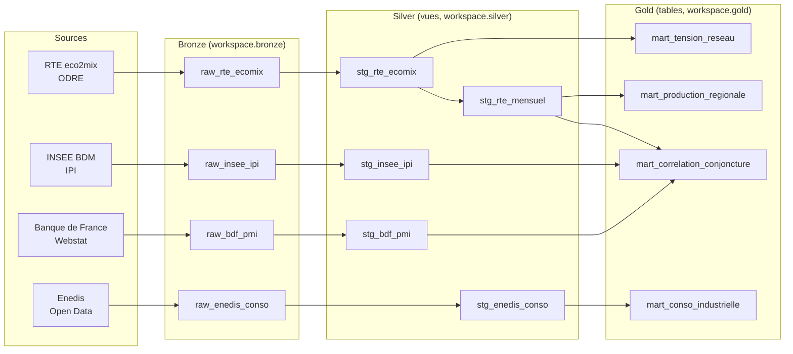

# Lineage du projet dbt : de Bronze à Gold

Ce document décrit comment les données circulent dans le projet, de chaque source brute jusqu'aux
tables finales consommées par Power BI, et pourquoi chaque transformation existe. Il sert de base à la
section « Architecture » du README.

Les volumes cités sont ceux du dernier chargement (octobre 2026).

## Vue d'ensemble

| Couche | Rôle | Matérialisation | Schéma |
|---|---|---|---|
| Bronze | Copie brute des API, sans interprétation | tables Delta (écrites par les scripts Python) | `bronze` |
| Silver | Typage, nettoyage, dédoublonnage, une source à la fois | vues | `silver` |
| Gold | Indicateurs prêts pour le dashboard, un mart par usage | tables | `gold` |

La couche `intermediate/` existe dans le dépôt mais reste vide : aucune jointure entre sources n'était
nécessaire avant les marts.

## Étape 1 : Bronze, un contrat unique

Les quatre tables `raw_*` ont exactement le même schéma, alimenté par `ingestion/src/bronze.py` :

| Colonne | Contenu |
|---|---|
| `source_dataset` | identifiant du jeu de données côté API |
| `extracted_for` | paramètre d'extraction (jour, année ou fenêtre de mois) |
| `payload` | l'enregistrement renvoyé par l'API, en JSON brut |
| `ingested_at` | horodatage UTC du chargement |

**Pourquoi du JSON brut.** Les API renvoient des types instables (RTE publie parfois `"ND"` ou des
nombres sérialisés en texte). Typer à l'ingestion ferait échouer le chargement ou perdrait de la
donnée. Le typage est donc repoussé en Silver, où une valeur invalide devient `NULL` au lieu de
bloquer le pipeline.

**Pourquoi en ajout seul (append-only).** Rejouer une ingestion ne supprime rien. Les doublons
éventuels sont éliminés en Silver, qui conserve toujours la dernière version chargée. Ce choix rend
chaque chargement rejouable sans risque, au prix d'un peu de stockage supplémentaire.

## Étape 2 : Silver, une vue par source

Chaque modèle suit la même structure : extraction des champs du JSON avec `try_cast`, filtre de
qualité sur la clé, dédoublonnage par `row_number()`, puis clé de substitution
(`dbt_utils.generate_surrogate_key`) testée `not_null` et `unique`.

### `stg_rte_ecomix` : 149 020 lignes

Source : `raw_rte_ecomix`. Production et consommation de la région Pays de la Loire.

- **Deux jeux fusionnés.** Le jeu temps réel (pas de 15 min, environ trois mois d'historique) et le jeu
  consolidé/définitif (pas de 30 min, depuis 2013). Pour un même créneau, on garde la donnée la plus
  consolidée (définitive, puis consolidée, puis temps réel), puis le chargement le plus récent.
- **Créneaux sans consommation exclus.** Le jeu temps réel publie à l'avance tous les créneaux de la
  journée, avec des valeurs vides.
- **Unités.** Puissances en MW, taux en %.

Le grain est donc mixte : 15 minutes pour le temps réel (96 lignes), 30 minutes pour le reste.

### `stg_rte_mensuel` : 102 lignes (un mois par ligne)

Source : `stg_rte_ecomix`, restreint au jeu consolidé/définitif.

- **Pourquoi `cons-def` seul.** Le temps réel couvre trois mois et n'a pas le même pas : le mélanger
  fausserait la somme mensuelle.
- **MW devient MWh.** Chaque créneau de 30 minutes pèse 0,5 h. Une somme brute de MW n'aurait pas
  d'unité d'énergie.
- **`est_mois_complet`.** Compare le nombre de créneaux à 48 par jour. Mars compte 2 créneaux de
  moins (passage à l'heure d'été) ; en octobre, la source ne publie pas l'heure répétée, donc rien à
  ajouter. Résultat : 101 mois complets sur 102 (janvier 2018 est tronqué).
- Il porte aussi la production mensuelle par filière (thermique, nucléaire, éolien, solaire,
  hydraulique, bioénergies).

### `stg_enedis_conso` : 15 777 lignes

Source : `raw_enedis_conso`. Consommation annuelle par commune et secteur d'activité (année chargée :
2023).

- **Grain réel : année × commune × grand secteur × secteur NAF2 × catégorie de consommation.** Une
  première version dédoublonnait sur année × commune × grand secteur seulement : elle ne gardait que
  5 600 lignes et perdait la moitié de la consommation (11,0 contre 21,3 millions de MWh). Les tests
  passaient quand même, car la clé était bien unique après dédoublonnage. La clé complète a corrigé ce
  défaut, et la somme du modèle est maintenant identique à celle de Bronze.
- **Code commune sur 5 caractères.** `lpad` restaure les zéros de tête perdus.
- Le code NAF2 est vide pour les petits professionnels et pour le résidentiel : il n'est pas filtré.

### `stg_insee_ipi` : 252 lignes

Source : `raw_insee_ipi`. Indice de production industrielle, trois séries mensuelles corrigées des
variations saisonnières et des jours ouvrés (base 100 en 2021), sur 84 mois.

- **Aplatissement XML.** L'API de l'INSEE répond en SDMX XML ; le script d'ingestion produit une ligne
  par série et par période, que Silver convertit en date (premier jour du mois).
- **Dernière ingestion retenue.** Les séries INSEE sont révisées : la valeur la plus récente fait foi.
- Les séries sont nationales : l'INSEE ne publie pas d'IPI régional dans la BDM.

### `stg_bdf_pmi` : 336 lignes

Source : `raw_bdf_pmi`. Quatre séries de l'enquête mensuelle de conjoncture de la Banque de France pour
les Pays de la Loire (industrie manufacturière), sur 84 mois.

- **Pas de vrai PMI.** Le PMI est un indice S&P Global ; la Banque de France n'en publie pas. Les
  soldes d'opinion régionaux servent d'équivalent. Le nom `stg_bdf_pmi` est conservé par continuité.
- Même logique que l'INSEE : conversion en date mensuelle et dernière ingestion retenue.

## Étape 3 : Gold, un mart par usage

Aucun `select *` dans cette couche : chaque colonne est nommée et documentée.

### `mart_conso_industrielle` : 4 149 lignes

`stg_enedis_conso` filtré sur le grand secteur `INDUSTRIE`, renommé pour la lecture métier
(`libelle_commune`, `nb_points_de_soutirage`). Destiné à la carte par commune.

- Le grain inclut la catégorie (ENT ou PRO), sinon la colonne `categorie_consommation` créerait des
  doublons. Les sites PRO n'ont pas de code NAF2.
- Les valeurs de consommation absentes à la source restent vides, sans être remplacées par zéro.

### `mart_production_regionale` : 102 lignes

`stg_rte_mensuel` : production totale, production renouvelable (éolien, solaire, hydraulique,
bioénergies), consommation et `taux_couverture_enr` (production renouvelable ÷ consommation × 100).

- Les valeurs vides d'une filière comptent pour zéro dans les sommes : le nucléaire est absent en
  Pays de la Loire.
- Le taux moyen est de 19 %, de 6,6 % à 41,9 % selon le mois. Filtrer sur `est_mois_complet` pour
  toute analyse de tendance.

### `mart_correlation_conjoncture` : 84 lignes

Jointure mensuelle de `stg_rte_mensuel`, `stg_insee_ipi` et `stg_bdf_pmi`, avec les variations de chaque
indicateur d'un mois sur l'autre.

- **Une série par source**, choisie dans `dbt_project.yml` (`mart_ipi_idbank`, `mart_bdf_series_key`) :
  l'IPI de l'industrie manufacturière et le climat des affaires régional. Changer de série ne demande
  aucune modification SQL.
- **Jointure interne.** Le mart couvre les mois présents dans les trois sources (2018 à 2024) et
  s'étendra tout seul quand elles seront rechargées plus loin.
- **La consommation est celle de toute la région** (`conso_regionale_mwh`), pas celle de l'industrie :
  RTE ne distingue pas les secteurs, et la consommation industrielle n'existe qu'en annuel (Enedis).
- La variation n'est calculée que si le mois précédent est bien le mois civil précédent.

### `mart_tension_reseau` : 149 020 lignes

`stg_rte_ecomix` à la maille du créneau : production et consommation en MWh sur la durée du créneau
(15 ou 30 minutes, colonne `pas_minutes`), écart absolu, `taux_couverture_locale` (production ÷
consommation × 100) et `variation_couverture_pct` (écart relatif à la moyenne des taux du même mois).

- **Pourquoi des indicateurs relatifs.** La région produit en moyenne 880 MW pour 3 000 MW consommés et
  importe le reste : l'écart absolu est presque toujours négatif et ne discrimine rien. Une version
  précédente avec un statut `SURPLUS` / `EQUILIBRE` / `TENSION` donnait `TENSION` sur 99,8 % des
  créneaux ; elle a été remplacée.
- Le taux de couverture progresse de 25 % en 2018 à 35 % en 2025, et monte en milieu de journée
  (effet du solaire).
- La variation est asymétrique (de −96 % à +432 %) : la médiane est plus parlante que la moyenne.

## Contrôle qualité

95 tests dbt couvrent les couches Bronze (colonnes des sources), Silver et Gold : `not_null` sur les
colonnes clés, `unique` sur chaque clé de substitution, unicité de la combinaison de colonnes qui
définit le grain, et `accepted_values` sur les codes connus. Un test sur les catégories Enedis est en
sévérité `warn` : l'apparition d'une nouvelle catégorie est signalée sans bloquer le pipeline.

## Limites connues

- **Couverture temporelle inégale.** RTE va jusqu'en juin 2026, INSEE et Banque de France jusqu'en
  décembre 2024, Enedis ne couvre que 2023. La corrélation porte donc sur 2018-2024.
- **Corrélation faible.** Entre consommation régionale et IPI, la corrélation mensuelle est de 0,16 ;
  la consommation brute est dominée par le chauffage. Répondre à la question décisionnelle demandera
  de corriger de la température.
- **Doublons en Bronze.** Plusieurs chargements concurrents ont dupliqué des lignes. Aucun effet sur
  Silver et Gold, qui dédoublonnent, mais du stockage est consommé pour rien.
- **Grain RTE mixte.** Les créneaux sont à 15 min en temps réel et à 30 min dans l'historique.
